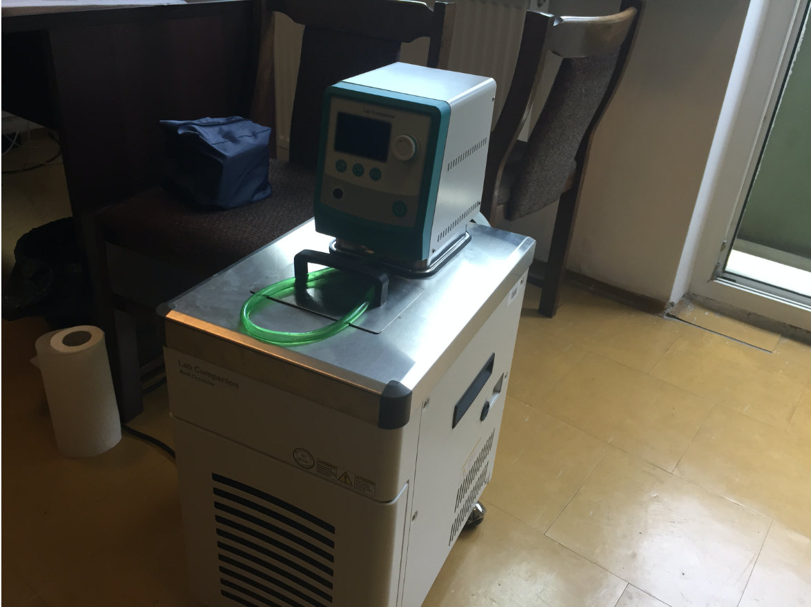

# Ból. Co to takiego?

* Zastanów się w grupach (5 min.)
* Opracujcie definicję bólu

---

# Definicja International Association for the Study of Pain (IASP)

Ból to nieprzyjemne doznanie sensoryczne i emocjonalne powiązane z faktycznym lub potencjalnym uszkodzeniem tkanek, lub opisywane w kategoriach takiego uszkodzenia.

--- 

# Uwagi do definicji IASP

* Niemożność komunikowania doznań bólowych **nie oznacza**, że pacjenta nie boli i nie wymaga on leczenia
* Ból jest zawsze **subiektywny**
* Ból składa się z dwóch komponentów:
    * sensoryczny (boli nas noga)
    * emocjonalny (cierpimy z powodu bólu nogi)

---

# Uwagi do definicji bólu, cd.

* Ból często powiązany jest z uszkodzeniem tkanek ale **nie zawsze**
* Często ból nie ma jasnej przyczyny patofizjologicznej
* Najprawdopodobniej wiąże się to z zaburzonym funkcjonowaniem CUN
* *Pain is in the brain*

---

# Ból jest subiektywny

* Jeśli pacjent mówi, że go boli - to znaczy że go boli. Najczęściej.
* "Aktywność receptorów bólowych i dróg bólowych w układzie nerwowym indukowana przez bodziec bólowy nie jest bólem. Ból to zawsze **stan psychologiczny**" (IASP Taxonomy)

---

# Funkcje bólu

* Zastanówcie się w grupach (5 min.)
* Po co jest ból? Napiszcie jak najwięcej funkcji

---

# Funkcje bólu

* Funkcja ucieczki – wrażenia bólowe powodują chęć natychmiastowego uniknięcia źródła bólu
* Ułatwienie leczenia – organizm szybciej dojdzie do zdrowia, gdy nie będziemy np. przeciążać bolącej nogi

---

# Funkcje bólu

* Funkcja motywacyjna – uczymy się (na drodze warunkowania) unikać bodźców, które sprawiły nam ból w przeszłości
* Ból jest kluczowy dla przetrwania – osoby z wrodzoną obojętnością na ból mają krótszą spodziewaną długość życia

---

# Ból receptorowy vs. neuropatyczny vs. nocyplastyczny

---

# Ból receptorowy

* Ból, który powstaje w wyniku faktycznego lub możliwego uszkodzenia tkanek (z wyjątkiem tkanki nerwowej)
* Spowodowany jest (normalną) aktywacją **nocyreceptorów** (receptorów bólowych)
* Np.: rozcięcie skóry, złamanie nogi, opuchlizna, oparzenia, odmrożenia itd.

---

# Ból neuropatyczny

* Ból spowodowany uszkodzeniem bądź chorobą *somatosensorycznego* układu nerwowego
* Np.: neuralgia nerwu trójdzielnego, neuropatia cukrzycowa, bóle fantomowe

---

# Ból nocyplastyczny

* Ból spowodowany zmienioną (*altered*) nocycepcją pomimo braku faktycznego bądź możliwego uszkodzenia tkanek powodujących aktywację nocyreceptorów oraz braku choroby lub uszkodzenia somatosensorycznego układu nerwowego
* Trzecia kategoria, *de facto* obejmująca ból który nie jest ani nocyceptywny, ani neuropatyczny
* Np.: fibromialgia, kompleksowy zespół bólu regionalnego, ból w zespole jelita drażliwego, niespecyficzny ból dolnego odcinka kręgosłupa

---

# Ból ostry vs. ból przewlekły

* Ból przewlekły to ból trwający dłużej niż 3/6 miesięcy
* Ból przewlekły to ból trwający dłużej niż spodziewany okres wyleczenia
* Ból przewlekły = choroba sama w sobie
* Problem chronifikacji

---

# Inne pojęcia z zakresu badania bólu

* Analgezja - zmniejszenie odczuwania bólu
* Hiperalgezja - zwiększenie odczuwania bólu
* Allodynia - *przeczulica*, bodziec dotykowy odbierany jako bolesny
* Placebo - teoretycznie obojętne oddziaływanie **zmniejsza** ból
* Nocebo - teoretycznie obojętne oddziaływanie **zwiększa** ból

---

# Narzędzia oceny bólu

---

# VAS (Visual Analog Scale)

---

# NRS (Numerical Rating Scale)

---

# FACES

---

# FACES

---

# Obserwacyjna skala FLACC

* Face
* Legs
* Arms
* Cry
* Consolability
* (Children’s Hospital of Eastern Ontario Pain Scale)

---

# BPI

---

# BPI

---

# BPI

---

# Ból w laboratorium

---

---

