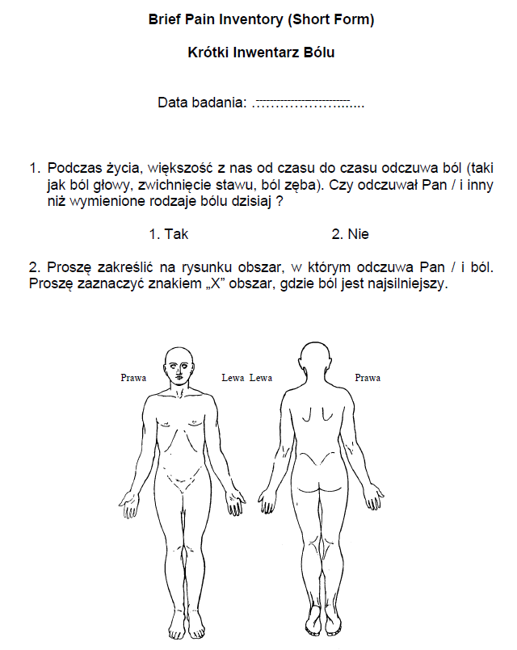

### O kursie

- 30 godzin, 10 spotkań (czwartki, 10:15-12:30)
- <http://kbas.gumed.edu.pl/bol>
- k.basinski@gumed.edu.pl

### Co trzeba zrobić żeby zaliczyć

- 2 (?) kolokwia
- Prezentacja zaliczeniowa
- Ocena końcowa - prosta średnia z kolokwiów i prezentacji
- Punkty za ogólną bystrość (aktywność na zajęciach)

### Tematy prezentacji

1. Central pain syndrome
2. Complex regional pain syndrome
2. Ból w zespole jelita drażliwego
2. Bóle głowy
2. Ból nowotworowy
2. Fibromialgia
2. Ból porodowy
2. Wrodzona obojętność na ból
2. Ból fantomowy

### Literatura

- Damasio, A., & Carvalho, G. B. (2013). The nature of feelings: Evolutionary and neurobiological origins. Nature Reviews Neuroscience, 14(2), 143–152. https://doi.org/10.1038/nrn3403 [link](https://www.researchgate.net/profile/Gil_Carvalho/publication/234161523_OPINION_The_nature_of_feelings_evolutionary_and_neurobiological_origins/links/569581c508ae820ff074c699/OPINION-The-nature-of-feelings-evolutionary-and-neurobiological-origins.pdf)
- (Bud) Craig, A. (2003). A new view of pain as a homeostatic emotion. Trends in Neurosciences, 26(6), 303–307. https://doi.org/10.1016/S0166-2236(03)00123-1 [link](https://www.sciencedirect.com/science/article/pii/S0166223603001231)
- Fields, H. L. (2018). How expectations influence pain. Pain, 159(9), S3–S10. https://doi.org/10.1097/j.pain.0000000000001272 [link](https://journals.lww.com/pain/Fulltext/2018/09001/How_expectations_influence_pain.2.aspx?casa_token=iRYv7ruuBfUAAAAA:QTLXkB51QyzquCA7P7EyoZCvPqcjS1cU3EHV54kt9Um-dPn8n7tFNbkFYn11f4wX5UKBjddORLeNx9Q_zov0arBwugk)

### Literatura

- Tabor, A., & Burr, C. (2019). Bayesian Learning Models of Pain: A Call to Action. Current Opinion in Behavioral Sciences, 26, 54–61. https://doi.org/10.1016/j.cobeha.2018.10.006 [link](https://www.sciencedirect.com/science/article/pii/S2352154618300810)
- Baliki, M. N., & Apkarian, A. V. (2015). Nociception, Pain, Negative Moods, and Behavior Selection. Neuron, 87(3), 474–491. https://doi.org/10.1016/j.neuron.2015.06.005 [link](https://www.sciencedirect.com/science/article/pii/S0896627315005188)
- Bushnell, M. C., Čeko, M., & Low, L. A. (2013). Cognitive and emotional control of pain and its disruption in chronic pain. Nat Rev Neurosci, 14(7), 502-511. https://doi.org/10.1038/nrn3516.Cognitive [link](https://www.ncbi.nlm.nih.gov/pmc/articles/PMC4465351/)

### Literatura

Jeśli byłby problem z dostępem (paywall), piszcie mi maila!

### Na za tydzień

Damasio, A., & Carvalho, G. B. (2013). The nature of feelings: Evolutionary and neurobiological origins. Nature Reviews Neuroscience, 14(2), 143–152.

### Ból - podstawowe definicje (Taksonomia IASP)

### Źródła

### Ból

Nieprzyjemne doznanie sensoryczne i emocjonalne, powiązane z faktycznym lub potencjalnym uszkodzeniem tkanek, lub opisywane w kategoriach takiego uszkodzenia.

### Uwagi do definicji bólu

- Niemożność komunikowania doznań bólowych **nie oznacza**, że pacjenta nie boli i nie wymaga on leczenia
- Ból jest zawsze **subiektywny**
- Ból składa się z dwóch komponentów:
    - sensoryczny (boli nas noga)
    - emocjonalny (cierpimy z powodu bólu nogi)

### Uwagi do definicji bólu, cd.

- Ból często powiązany jest z uszkodzeniem tkanek ale **nie zawsze**
- Często ból nie ma jasnej przyczyny patofizjologicznej
- Najprawdopodobniej wiąże się to z zaburzonym funkcjonowaniem CUN
- *Pain is in the brain*

### Ból jest subiektywny

- Jeśli pacjent mówi, że go boli - to znaczy że go boli. Najczęściej.
- "Aktywność receptorów bólowych i dróg bólowych w układzie nerwowym indukowana przez bodziec bólowy nie jest bólem. Ból to zawsze **stan psychologiczny**" (IASP Taxonomy)

### Funkcje bólu

- Funkcja ucieczki – wrażenia bólowe powodują chęć natychmiastowego uniknięcia źródła bólu
- Ułatwienie leczenia – organizm szybciej dojdzie do zdrowia, gdy nie będziemy np. przeciążać bolącej nogi

### Funkcje bólu

- Funkcja motywacyjna – uczymy się (na drodze warunkowania) unikać bodźców, które sprawiły nam ból w przeszłości
- Ból jest kluczowy dla przetrwania – osoby z wrodzoną obojętnością na ból mają krótszą spodziewaną długość życia

### Ból receptorowy vs. neuropatyczny vs. nocyplastyczny

### Ból receptorowy

- Ból, który powstaje w wyniku faktycznego lub możliwego uszkodzenia tkanek (z wyjątkiem tkanki nerwowej)
- Spowodowany jest (normalną) aktywacją **nocyreceptorów** (receptorów bólowych)
- Np.: rozcięcie skóry, złamanie nogi, opuchlizna, oparzenia, odmrożenia itd.

### Ból neuropatyczny

- Ból spowodowany uszkodzeniem bądź chorobą *somatosensorycznego* układu nerwowego
- Np.: neuralgia nerwu trójdzielnego, neuropatia cukrzycowa, bóle fantomowe

### Ból nocyplastyczny

- Ból spowodowany zmienioną (*altered*) nocycepcją pomimo braku faktycznego bądź możliwego uszkodzenia tkanek powodujących aktywację nocyreceptorów oraz braku choroby lub uszkodzenia somatosensorycznego układu nerwowego
- Trzecia kategoria, *de facto* obejmująca ból który nie jest ani nocyceptywny, ani neuropatyczny
- Np.: fibromialgia, kompleksowy zespół bólu regionalnego, ból w zespole jelita drażliwego, niespecyficzny ból dolnego odcinka kręgosłupa

### Ból ostry vs. ból przewlekły

- Ból przewlekły to ból trwający dłużej niż 3/6 miesięcy
- Ból przewlekły to ból trwający dłużej niż spodziewany okres wyleczenia
- Ból przewlekły = choroba sama w sobie
- Problem chronifikacji

### Inne pojęcia z zakresu badania bólu

- Analgezja - zmniejszenie odczuwania bólu
- Hiperalgezja - zwiększenie odczuwania bólu
- Allodynia - *przeczulica*, bodziec dotykowy odbierany jako bolesny
- Placebo - teoretycznie obojętne oddziaływanie **zmniejsza** ból
- Nocebo - teoretycznie obojętne oddziaływanie **zwiększa** ból

### Nocycecpcja

### Nocycepcja

- Aktywacja receptorów bólowych i dróg przewodzenia bodźców bólowych (*pain pathways*)
- Jeśli wszystko jest w porządku, skutkuje odczuciem ostrego bólu
- Proces stricte fizjologiczny (?)

### Nocycepcja

- Nocyreceptory - receptory reagujące na informację bólową, obecne w skórze, mięśniach, stawach etc.
- Bodźce bólowe przewodzone są poprzez dwa rodzaje włókien:
    + Aδ - z osłoną mielinową - szybkie przewodnictwo
    + C - bez osłony - wolne przewodnictwo, tzw. "drugi ból"
- Zakończenia włókien w korzeniu grzbietowym nerwu rdzeniowego

### Nocyreceptory

- Niektóre wyczulone specyficznie na różne typy stymulacji, np. ciepło, ucisk, oparzenia chemiczne itd.
- Receptory różnią się progiem aktywacji - niektóre (tzw. "ciche" receptory) potrzebują bardzo dużej stymulacji żeby się uaktywnić

### Nocyreceptory

- Większość receptorów włókien C nie ulega habiutacji tylko **sensytyzacji**
- W trakcie przedłużającej się stymulacji bólowej aktywować mogą się dodatkowe, bardziej odległe receptory
- Nocycepcja może się utrzymywać, nawet jeśli **nie ma już pierwotnego źródła bólu**

### Teoria bramkowania (Melzack, Wall)

### Teoria bramkowania (Melzack, Wall)

### Teoria bramkowania (Melzack, Wall)

- W swoim rozwinięciu teoria bramkowania mówi, że mechanizm bramki może być regulowany przez mechanizmy centralne
- Nie bardzo wiadomo jakie mechanizmy centralne

### Transmisja informacji bólowej

- Z nocyreceptorów przez włókna Aδ i C do rdzenia kręgowego
- W rdzeniu pierwsze "przetwarzanie"
- Z rdzenia kręgowego do wzgórza (*spinothalamic tract*)
- Z wzgórza do kory

### Transmisja informacji bólowej

### Narzędzia oceny bólu

### VAS (Visual Analog Scale)

### NRS (Numerical Rating Scale)

### FACES

### FACES

### Obserwacyjna skala FLACC

- Face
- Legs
- Arms
- Cry
- Consolability
- (Children’s Hospital of Eastern Ontario Pain Scale)

### BPI

### BPI

### BPI

