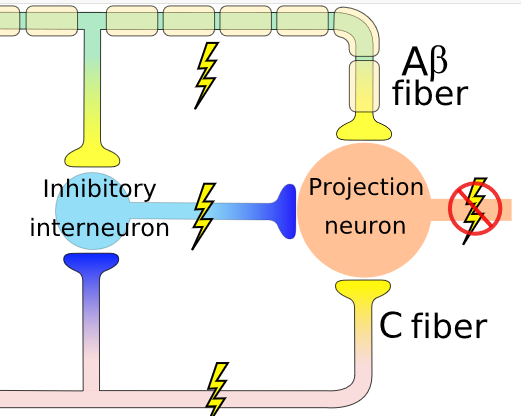
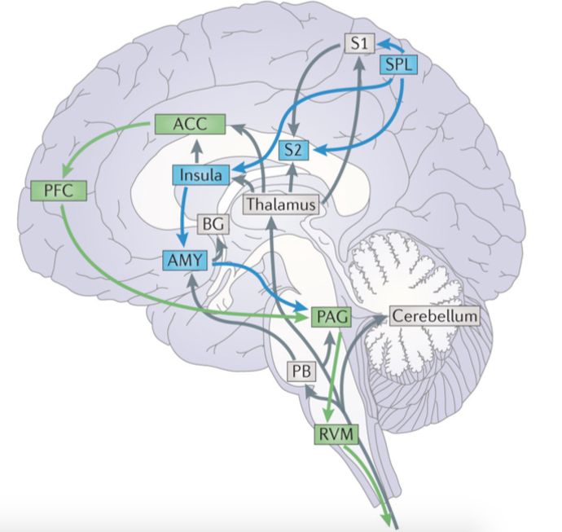

# Nocycepcja

---

# Nocycepcja

* Aktywacja receptorów bólowych i dróg przewodzenia bodźców bólowych (*pain pathways*)
* Jeśli wszystko jest w porządku, skutkuje odczuciem ostrego bólu
* Proces stricte fizjologiczny (?)

---

# Nocycepcja

* Nocyreceptory - receptory reagujące na informację bólową, obecne w skórze, mięśniach, stawach etc.
* Bodźce bólowe przewodzone są poprzez dwa rodzaje włókien:
    * Aδ - z osłoną mielinową - szybkie przewodnictwo
    * C - bez osłony - wolne przewodnictwo, tzw. "drugi ból"
* Zakończenia włókien w korzeniu grzbietowym nerwu rdzeniowego

---

# Nocyreceptory

* Niektóre wyczulone specyficznie na różne typy stymulacji, np. ciepło, ucisk, oparzenia chemiczne itd.
* Receptory różnią się progiem aktywacji - niektóre (tzw. "ciche" receptory) potrzebują bardzo dużej stymulacji żeby się uaktywnić

---

# Nocyreceptory

* Większość receptorów włókien C nie ulega **habiutacji** tylko **sensytyzacji**
* W trakcie przedłużającej się stymulacji bólowej aktywować mogą się dodatkowe, bardziej odległe receptory
* Nocycepcja może się utrzymywać, nawet jeśli **nie ma już pierwotnego źródła bólu**

---

# Teoria bramkowania (Melzack, Wall)

---

# Teoria bramkowania (Melzack, Wall)

---

# Teoria bramkowania (Melzack, Wall)

* W swoim rozwinięciu teoria bramkowania mówi, że mechanizm bramki może być regulowany przez mechanizmy centralne
* Nie bardzo wiadomo jakie mechanizmy centralne

---

# Transmisja informacji bólowej

- Z nocyreceptorów przez włókna Aδ i C do rdzenia kręgowego
- W rdzeniu pierwsze "przetwarzanie"
- Z rdzenia kręgowego do wzgórza (*spinothalamic tract*)
- Z wzgórza do kory

---

# Transmisja informacji bólowej

---

# Przetwarzanie informacji bólowej w CUN
- Móżdżek (Cb)
- Wzgórze (Thal)
- Wyspa (Ins)
- Przednia część zakrętu obręczy (ACC)
- PIerwszorzędowa kora czuciowa (SI)
- Drugorzędowa kora czuciowa (SII)
- Dodatkowa kora ruchowa (SMA)

---

# Przewtwarzanie bólu w CUN

---

# Modulacja bólu
- Modulacja bólu - zmiana odczuć bólowych (analgezja lub hiperalgezja) na skutek innych procesów, również psychologicznych
- DPMS - *Descending Pain Modulation System*
- Istota szara okołowodociągowa (PAG)
- Z perspektywy psychologicznej istotna modulacja *emocjonalna* i *poznawcza*

---

# Modulacja bólu

---

# Emocjonalna (afektywna) modulacja bólu

- Pozytywny afekt naczęściej **zmniejsza** nasilenie bólu
- Negatywny afekt najczęściej **zwiększa** nasilenie bólu
- Nie zawsze - *stress-induced analgesia*
- Istotne uwikłanie układu limbicznego w przetwarzanie i modulację bólu (ACC)
- Związki bólu z depresją

---

# Poznawcza modulacja bólu
- Koncentracja uwagi na bólu **zwiększa** ból
- Odwrócenie uwagi od bólu **zmniejsza** ból
- Efekt placebo
- Efekt nocebo

