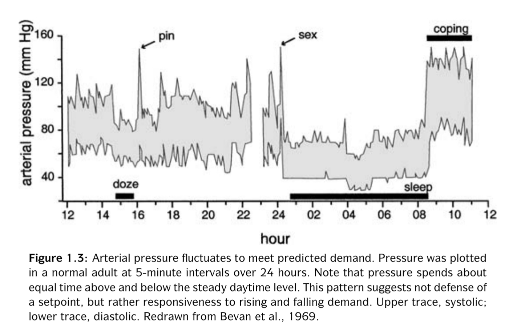
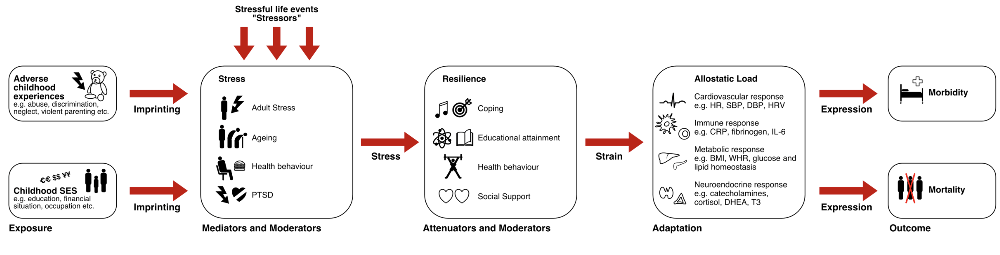

# Homeostaza i allostaza

> Na podstawie: Peter Sterling (2004), _Principles of Allostasis: Optimal Design, Predictive Regulation, Patophysiology and Rational Therapeutics_. W: Allostasis, Homeostasis, and the Costs of Physiological Adaptation. Jay Schulkin (Ed.). Cambridge University Press.

---

# Homeostaza

* Claude Bernard, Walter Cannon, przełom XIX i XX w.
* Celem fizjologii jest utrzymywanie stałych warunków wewnątrz organizmu
* Optymalna temperatura, ciśnienie krwi, stężenie glukozy, gospodarka sodowo-potasowa itd.
* Zachwianie homeostazy powoduje uruchomienie sprzężeń zwrotnych 

---

# Problem z homeostazą

---

# Ciśnienie krwi

* 110/70 to nie poziom optymalny tylko **średni**
* Odzwierciedla poziom najczęstszy ale nie najbardziej optymalny
* Większe zapotrzebowanie na tlen (np. z powodu wysiłku) wymaga wyższego ciśnienia

---

# Allostaza

* Celem fizjologii nie jest zachowanie stałych parametrów tylko zwiększenie szansy na sukces reprodukcyjny
* Parametry fizjologiczne fluktuują, ale nie z powodu zachwiania homeostazy
* Fluktuacje służą optymalizacji
* Allostaza: **coordinated variation to optimize performance at the least cost** (Sterling, 2004)
  
---

# Zasady allostazy

1. Organizmy są wydajne
2. Wydajność wymaga wzajemnych "poświęceń" (_reciprocal trade-offs_)
3. Wydajność wymaga przewidywania potrzeb
4. Przewidywanie wymaga dostrojenia sensorów do spodziewanych bodźców
5. Przewidywanie wymaga dostrojenia efektorów do spodziewanego zapotrzebowania
6. Regulacja predyktywna zależy od zachowania, które również podlega adaptacji

---

# Organizmy są wydajne

* Systemy fizjologiczne muszą być wydajne aby dobrze działać w większości prawdopodobnych sytuacji
* Zbyt duża wydajność (odporność na bardzo nieprawdopodobne, ekstremalne warunki) powoduje za duże koszty utrzymania
* Zbyt mała wydajność (brak odporności na prawdopodobne zdarzenia) jest w oczywisty sposób bez sensu

---

# Wydajność wymaga wzajemnych poświęceń

* _Reciprocal trade-offs_
* Poszczególne systemy/organy mogą dzielić się zasobami
* W czasie spoczynku zapotrzebowanie mięśni szkieletowych na krew to 1,2 l/min
* W czasie 100% wysiłku rośnie do 22l/min
* Nerki chwilowo dostają mniej krwi, żeby zaspokoić zapotrzebowanie mięśni
* To wymaga **centralnego sterowania**!

---

# Wydajność wymaga przewidywania potrzeb

* Reagowanie na zachwiania równowagi jest niewystarczające i zbyt kosztowne
* Optymalnie jest **przewidywać** potrzeby i reagować na nie
* Osoba z cukrzycą zrobi sobie zastrzyk z insuliny **przed** posiłkiem
* Naczelną funkcją mózgu jest **przewidywanie przyszłych stanów** w celu optymalizacji metabolicznej

---

# Obciążenie allostatyczne 

* _Allostatic load, the wear and tear of the body_ ("zużycie organizmu")
* Regulacja allostatyczna pozwala radzić sobie z trudnościami
* Gdy trzeba się regulować długo, narasta _obciążenie allostatyczne_ (McEwen, Stellar, 1993)
* Im większe długotrwałe obciążenie allostatyczne, tym więcej niekorzystnych konsekwencji dla zdrowia

---

---

# Więcej o allostazie i zdrowiu

