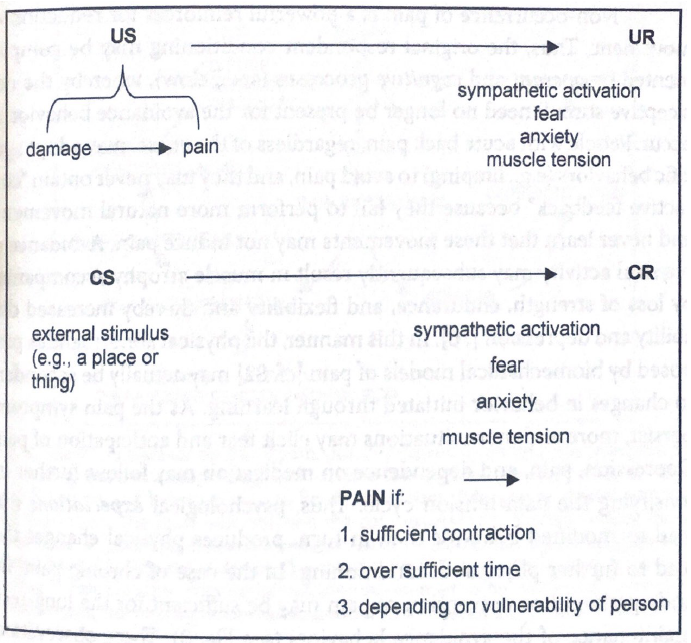
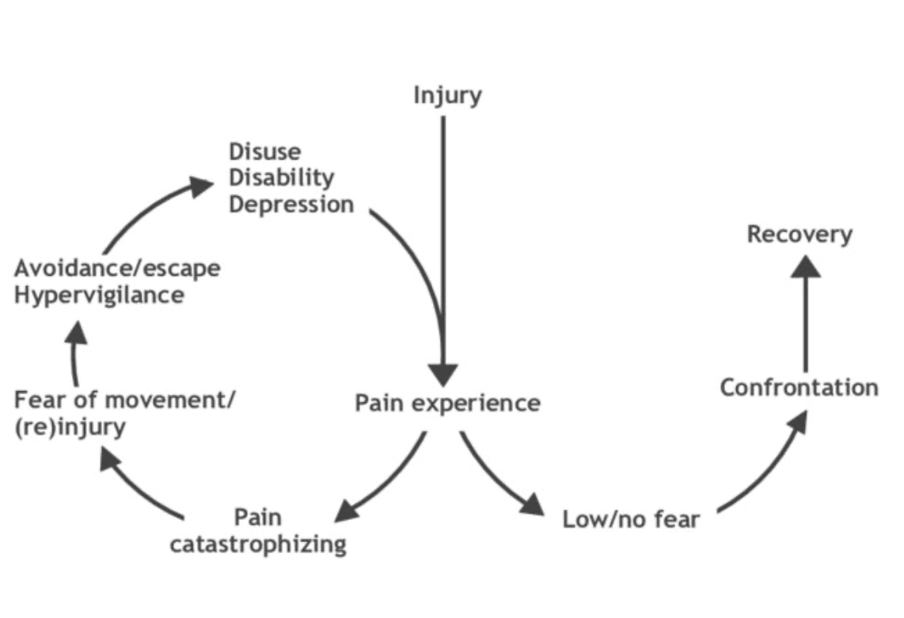

# Ból przewlekły

---

## Ból przewlekły a ból psychogenny
* Często dolegliwości bólowe są niewspółmierne do obserwowalnej patologii
* Wtedy sięga się po wyjaśnienia sugerujące "psychogenne" pochodzenie bólu
* Często zupełnie różne terapie dają podobne efekty
* Np. fibromialgia - ok. 50 różnych terapii farmakologicznych (od opioidów po iniekcje hormonem wzrostu) oraz 50 różnych terapii niefarmakologicznych (np. okładanie się błotem) ma potwierdzoną skuteczność w leczeniu bólu w FM
* Problem symulowania i wyłudzania świadczeń

---

## Modele psychologiczne (za Flor & Turk, 2011)

* Osobowość skłonna do bólu (*pain prone personality*)
* Podejście motywacyjne
* Habituacja i sensytyzacja
* Warunkowanie klasyczne
* Unikanie lękowe

---

## Osobowość skłonna do bólu (Blumer & Heilbronn, 1982)
* Istnieje wzorzec osobowości, który predestynuje do wzmożonego odczuwania bólu
* Autorzy proponują następujący zestaw cech:
    * Zaprzeczanie problemom interpersonalnym i emocjonalnym
    * Brak aktywności
    * Depresyjny nastrój
    * Poczucie winy
    * Bezsenność
    * Brak inicjatywy
    * Przypadki depresji, alkoholizmu i przewlekłego bólu w rodzinie
* Bardzo słabe podłoże empiryczne, krytyka podstaw logicznych tej teorii (Turk & Salovey, 1984)

---

## Osobowość a ból przewlekły - problem metod pomiaru

* Próby wykorzystania np. MMPI do pomiaru osobowości u chorych na ból przewlekły
* Duża ilość itemów "somatycznych", zwłaszcza odnoszących się do bólu

---

## Podejście motywacyjne - wyolbrzymianie objawów i symulowanie

* Podejście preferowane przez agencje ubezpieczeniowe i niektóre instytucje przyznające zasiłki
* Jeśli nie ma stwierdzonej patologii albo jest ona nieproporcjonalna do objawów, to pacjent:
    * wyolbrzymia objawy (*symptom magnification*)
    * symuluje (*malingering*)
* Problemy:
    * Nie ma żadnej metody pozwalającej stwierdzić obiektywnie natężenie dolegliwości bólowych
    * Są metody bazujące na niekonsekwencji w ocenie bólu przez pacjentów
    * Nie ma dowodów empirycznych na to, że ból maleje po dostaniu renty

---

## Podejście behawioralne - habituacja i sensytyzacja

* Habituacja - **spadek** intensywności bodźca na skutek powtarzającej się ekspozycji na identyczne bodźce
* Sensytyzacja - **wzrost** intensywności bodźca na skutek powtarzającej się ekspozycji na identyczne bodźce
* W warunku niskiego pobudzenia (np. relaksacji) habituacja jest ułatwiona
* Generalnie ludzie są zdolni do habituowania się do bólu (w odpowiednich warunkach)
* Chorzy na ból przewlekły mają z tym problem - jeden ze sugerowanych mechanizmów trwania stanu przewlekłego

---

# Podejście behawioralne - warunkowanie klasyczne (Gentry & Bernal, Linton et al.)

* Ból ostry - bodziec bezwarunkowy
* Reakcja na ból ostry - aktywacja sympatyczna, zwiększone napięcie mięśni, lęk - reakcja bezwarunkowa
* Na drodze warunkowania bodźce neutralne (np. przebywanie w określonych miejscach, wykonywanie określonych ruchów) zmieniają się w bodźce warunkowe
* Bodźce warunkowe warunkują reakcję warunkową - aktywacja sympatyczna, zwiększone napięcie mięśni, lęk
* Ta reakcja warunkowa może powodować kolejne dolegliwości bólowe jeśli:
    * napięcie mięśniowe jest wystarczające
    * czas trwania wystarczająco długi
    * jednostka ma predyspozycje (np. wcześniejszy uraz, cechy osobowości)

---

---

# Rozwinięcie - model unikania lękowego (fear-avoidance model)
* Oprócz warunkowania klasycznego, istotne też warunkowanie instrumentalne i procesy poznawcze
* Oczekiwania i przekonania wpływają na zachowanie
* Zachowanie może polegać na unikaniu czynności kojarzących się z bólem
* Unikanie może powodować nasilenie dolegliwości bólowych, a w konsekwencji stres i depresję
* Model ma dobre podłoże empiryczne
* Lęk i unikanie obecne są jako czynniki ryzyka w zaleceniach dotyczących leczenia chorych z CLBP

---

---

# Korelaty psychologiczne bólu przewlekłego

---

# Depresja
* Przewlekły ból współwystępuje z depresją
* U większości chorych depresja najprawdopodobniej wynikiem bólu
* U jakiejś części na pewno ból wynikiem depresji
* Ocena poznawcza wpływu bólu na życie pacjenta decydująca dla pojawienia się depresji (Okifuji et al.)

---

# Interpretacja przyczyn bólu
- Większy ból odczuwali pacjenci onkologiczni, którzy atrybuowali ból progresji choroby (Spiegel, Bloom)
* Studium przypadku człowieka, u którego ból pleców był dobrze kontrolowany kodeiną, a który potrzebował dużych dawek opioidów gdy tylko dowiedział się o diagnozie (rak z przerzutami do kości)

---

# Katastrofizowanie
* Silnie negatywne przekonania na temat bólu, małe problemy urastają do rozmiarów katastrofy
* Silne dodatnie korelacje katastrofizowania z intensywnością bólu, w badaniach klinicznych i eksperymentalnych
* Ujemne korelacje strategii adaptacyjnych radzenia sobie z bólem z intensywnością bólu

