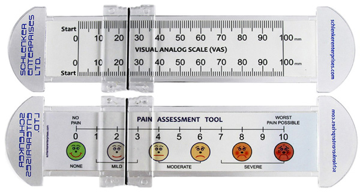
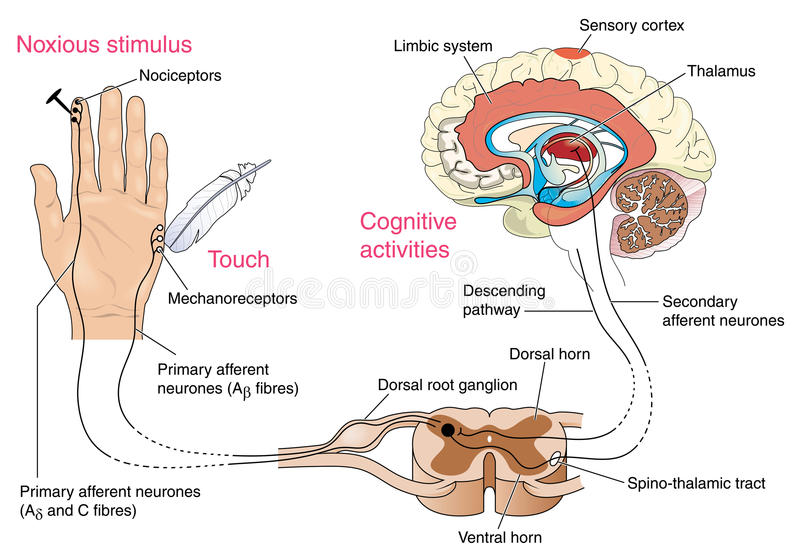

# Psychologia bólu

## Plan wykładu
- Ból - podstawowe definicje
- Narzędzia oceny bólu
- Nocycepcja - receptory bólowe, drogi bólowe, teorie dot. modulacji bólu
- Ból przewlekły - specyfika, problem chronifikacji, neuroplastyczność

# Ból - podstawowe definicje (Taksonomia IASP)

## Źródła

## Ból
Nieprzyjemne doznanie sensoryczne i emocjonalne, powiązane z faktycznym lub potencjalnym uszkodzeniem tkanek, lub opisywane w kategoriach takiego uszkodzenia.

## Uwagi do definicji bólu
- Niemożność komunikowania doznań bólowych **nie oznacza**, że pacjenta nie boli i nie wymaga on leczenia
- Ból jest zawsze **subiektywny**
- Ból składa się z dwóch komponentów:
    - sensoryczny (boli nas noga)
    - emocjonalny (cierpimy z powodu bólu nogi)

## Uwagi do definicji bólu, cd.
- Ból często powiązany jest z uszkodzeniem tkanek ale **nie zawsze**
- Często ból nie ma jasnej przyczyny patofizjologicznej
- Najprawdopodobniej wiąże się to z zaburzonym funkcjonowaniem CUN
- *Pain is in the brain*

## Ból jest subiektywny
- Jeśli pacjent mówi, że go boli - to znaczy że go boli. Najczęściej.
- "Aktywność receptorów bólowych i dróg bólowych w układzie nerwowym indukowana przez bodziec bólowy nie jest bólem. Ból to zawsze **stan psychologiczny**" (IASP Taxonomy)

## Funkcje bólu
- Funkcja ucieczki – wrażenia bólowe powodują chęć natychmiastowego uniknięcia źródła bólu
- Ułatwienie leczenia – organizm szybciej dojdzie do zdrowia, gdy nie będziemy np. przeciążać bolącej nogi
- Funkcja motywacyjna – uczymy się (na drodze warunkowania) unikać bodźców, które sprawiły nam ból w przeszłości
- Ból jest kluczowy dla przetrwania – osoby z wrodzoną obojętnością na ból mają krótszą spodziewaną długość życia

## Ból receptorowy vs. neuropatyczny vs. nocyplastyczny

## Ból receptorowy
- Ból, który powstaje w wyniku faktycznego lub możliwego uszkodzenia tkanek (z wyjątkiem tkanki nerwowej)
- Spowodowany jest (normalną) aktywacją **nocyreceptorów** (receptorów bólowych)
- Np.: rozcięcie skóry, złamanie nogi, opuchlizna, oparzenia, odmrożenia itd.

## Ból neuropatyczny
- Ból spowodowany uszkodzeniem bądź chorobą *somatosensorycznego* układu nerwowego
- Np.: neuralgia nerwu trójdzielnego, neuropatia cukrzycowa, bóle fantomowe

## Ból nocyplastyczny (Kosek, Cohen, Baron et al., 2016, PAIN)
- Ból spowodowany zmienioną (*altered*) nocycepcją pomimo braku faktycznego bądź możliwego uszkodzenia tkanek powodujących aktywację nocyreceptorów oraz braku choroby lub uszkodzenia somatosensorycznego układu nerwowego
- Trzecia kategoria, *de facto* obejmująca ból który nie jest ani nocyceptywny, ani neuropatyczny
- Np.: fibromialgia, kompleksowy zespół bólu regionalnego, ból w zespole jelita drażliwego, niespecyficzny ból dolnego odcinka kręgosłupa

## Ból ostry vs. ból przewlekły
- Ból przewlekły to ból trwający dłużej niż 3/6 miesięcy
- Ból przewlekły to ból trwający dłużej niż spodziewany okres wyleczenia
- Ból przewlekły = choroba sama w sobie
- Problem chronifikacji

## Inne pojęcia z zakresu badania bólu
- Analgezja - zmniejszenie odczuwania bólu
- Hiperalgezja - zwiększenie odczuwania bólu
- Allodynia - *przeczulica*, bodziec dotykowy odbierany jako bolesny
- Placebo - teoretycznie obojętne oddziaływanie **zmniejsza** ból
- Nocebo - teoretycznie obojętne oddziaływanie **zwiększa** ból

## Ból nowotworowy?
- Nocyceptywny (aktywacja receptorów bólowych w wyniku ucisku/obrzęku)
- Neuropatyczny (ucisk na nerwy, powikłanie chemioterapii/radioterapii)
- Nocyplastyczny (zmiany w CUN w wyniku bólu przewlekłego, *opioid-induced hyperalgesia*)
- Ostry (na początku choroby)
- Przewlekły (w zaawansowanej chorobie nowotworowej)

# Narzędzia oceny bólu

## VAS (Visual Analog Scale)

## NRS (Numerical Rating Scale)

## FACES

## FACES

## Obserwacyjna skala FLACC
- Face
- Legs
- Arms
- Cry
- Consolability
- (Children’s Hospital of Eastern Ontario Pain Scale)

## BPI

## BPI

## BPI

# Nocycecpcja

## Nocycepcja
- Aktywacja receptorów bólowych i dróg przewodzenia bodźców bólowych (*pain pathways*)
- Jeśli wszystko jest w porządku, skutkuje odczuciem ostrego bólu
- Proces stricte fizjologiczny (?)

## Nocycepcja
- Nocyreceptory - receptory reagujące na informację bólową, obecne w skórze, mięśniach, stawach etc.
- Bodźce bólowe przewodzone są poprzez dwa rodzaje włókien:
    + Aδ - z osłoną mielinową - szybkie przewodnictwo
    + C - bez osłony - wolne przewodnictwo, tzw. "drugi ból"
- Zakończenia włókien w korzeniu grzbietowym nerwu rdzeniowego

## Nocyreceptory
- Niektóre wyczulone specyficznie na różne typy stymulacji, np. ciepło, ucisk, oparzenia chemiczne itd.
- Receptory różnią się progiem aktywacji - niektóre (tzw. "ciche" receptory) potrzebują bardzo dużej stymulacji żeby się uaktywnić
- Większość receptorów włókien C nie ulega habiutacji tylko **sensytyzacji**
- W trakcie przedłużającej się stymulacji bólowej aktywować mogą się dodatkowe, bardziej odległe receptory
- Nocycepcja może się utrzymywać, nawet jeśli **nie ma już pierwotnego źródła bólu**

## Teoria bramkowania (Melzack, Wall)

## Teoria bramkowania (Melzack, Wall)

## Teoria bramkowania (Melzack, Wall)
- W swoim rozwinięciu teoria bramkowania mówi, że mechanizm bramki może być regulowany przez mechanizmy centralne
- Nie bardzo wiadomo jakie mechanizmy centralne

## Transmisja informacji bólowej
- Z nocyreceptorów przez włókna Aδ i C do rdzenia kręgowego
- W rdzeniu pierwsze "przetwarzanie"
- Z rdzenia kręgowego do wzgórza (*spinothalamic tract*)
- Z wzgórza do kory

## Transmisja informacji bólowej

## Przetwarzanie informacji bólowej w CUN
- Móżdżek (Cb)
- Wzgórze (Thal)
- Wyspa (Ins)
- Przednia część zakrętu obręczy (ACC)
- PIerwszorzędowa kora czuciowa (SI)
- Drugorzędowa kora czuciowa (SII)
- Dodatkowa kora ruchowa (SMA)

## Przewtwarzanie bólu w CUN

## Modulacja bólu
- Modulacja bólu - zmiana odczuć bólowych (analgezja lub hiperalgezja) na skutek innych procesów, również psychologicznych
- DPMS - *Descending Pain Modulation System*
- Istota szara okołowodociągowa (PAG)
- Z perspektywy psychologicznej istotna modulacja *emocjonalna* i *poznawcza*

## Modulacja bólu

## Emocjonalna (afektywna) modulacja bólu
- Pozytywny afekt naczęściej **zmniejsza** nasilenie bólu
- Negatywny afekt najczęściej **zwiększa** nasilenie bólu
- Nie zawsze - *stress-induced analgesia*
- Istotne uwikładnie układu limbicznego w przetwarzanie i modulację bólu (ACC)
- Związki bólu z depresją

## Poznawcza modulacja bólu
- Konentracja uwagi na bólu **zwiększa** ból
- Odwrócenie uwagi od bólu **zmniejsza** ból
- Efekt placebo
- Efekt nocebo

# Muzyczna analgezja - przykład poznawczej/emocjonalnej modulacji bólu

## Muzyka jest wszędzie
- Amerykanie wydają na muzykę więcej niż na lekarstwa (Huron, 2001)
- Włączając muzykę w tle, przeciętny człowiek spędza ok. 5 godzin czasu dziennie słuchając muzyki (Levitin, 2006)
- Funkcje muzyki (Rentfrow, Goldberg, Levitin, 2011):
    + Regulacja nastroju
    + Przyjemność estetyczna/artystyczna
    + Odwrócenie uwagi od codzienności
    + Definiowanie tożsamości
    + Poprawa koncentracji, zdolności poznawczych

## Badania
- Muzyka połączona z szumem zmniejsza ból u 5000 pacjentów poddanych
chirurgii dentystycznej (Gardner et al., 1960, Science)
- Muzyka obniża natężenie bólu, nieprzyjemne doznania oraz lęk u pacjentów z przewlekłym bólem (Finlay, 2013, Psychol Music)

## Badania
- Metaanaliza 47 randomizowanych badań klinicznych dot. bólu pooperacyjnego (Hole et al., 2015, Lancet):
    + Muzyka zmniejsza ból pooperacyjny, lęk i zapotrzebowanie na leki przeciwbólowe
    + Zwiększa satysfakcję pacjentów z leczenia
    + Jest efektywna nawet w znieczuleniu ogólnym
    + *“Muzyka może być oferowana pacjentom jako środek zmniejszający ból i lęk w okresie pooperacyjnym. Czas i metoda podania powinny być dostosowane do warunków panujących na oddziale”*

## Możliwe mechanizmy oddziaływania
- Dystrakcja
- Pozytywne emocje
- Jedno i drugie?

## Problem preferencji muzycznych
- Oddziaływanie muzyki na słuchacza jest bardzo indywidualne
- Różni ludzie różnie reagują na tą samą muzykę - preferencje muzyczne
- Preferencje mają strukturę wielowymiarową
- Próbą opisu tej struktury jest np. model AVD (Greenberg et al., 2016)

## Problem preferencji muzycznych

## Wymiary preferencji muzycznych (Greenberg et al.)
- Pobudzenie (Arousal):
    + muzyka szybka, głośna, agresywna vs. spokojna, stonowana
- Walencja (Valence):
    + muzyka wesoła vs. smutna
- Głębia (Depth):
    + muzyka „skomplikowana” vs. prosta

## Cel
- Jaka muzyka powoduje najbardziej korzystny efekt przeciwbólowy?
- Hipoteza: muzyka zgodna z indywidualnymi preferencjami
- Badanie N=100 zdrowych ochotników poddanych eksperymentalnej stymulacji bólowej w trakcie słuchania muzyki

## Osoby badane
- N = 30 zdrowych ochotników
- 15 kobiet, 15 mężczyzn
- Wiek: M = 37,10; SD = 15,71
- Kryteria wyłączenia: zespół bólowy, przyjmowanie leków przeciwbólowych, cukrzyca, nadciśnienie, zaburzenia krzepliwości, zespół Raynaud’a

## Metoda
- 4 warunki: muzyka charakterystyczna dla każdego z trzech wymiarów AVD i warunek szumu (kontrola)
- 2-minutowe „kompilacje” złożone z 15-sekundowych fragmentów
- Eksperymentalny ból – cold pressor task
- 3°C przez maks. 2 min. lub tyle ile badany wytrzyma
- Ocena:
    + średnie i maksymalne natężenie bólu (NRS 0-10)
    + próg bólu (sek.)
    + tolerancja bólu (sek.)

## Cold-pressor pain

## Wyniki

## Wyniki

# Ból przewlekły

## Ból przewlekły a ból psychogenny
- Często dolegliwości bólowe są niewspółmierne do obserwowalnej patologii
- Wtedy sięga się po wyjaśnienia sugerujące "psychogenne" pochodzenie bólu
- Często zupełnie różne terapie dają podobne efekty

## Ból przewlekły a ból psychogenny
- Np. fibromialgia - ok. 50 różnych terapii farmakologicznych (od opioidów po iniekcje hormonem wzrostu) oraz 50 różnych terapii niefarmakologicznych (np. okładanie się błotem) ma potwierdzoną skuteczność w leczeniu bólu w FM
- Problem symulowania i wyłudzania świadczeń

## Modele psychologiczne (za Flor & Turk, 2011)
- Osobowość skłonna do bólu (*pain prone personality*)
- Podejście motywacyjne
- Habituacja i sensytyzacja
- Warunkowanie klasyczne
- Unikanie lękowe

## Osobowość skłonna do bólu (Blumer & Heilbronn, 1982)
- Istnieje wzorzec osobowości, który predestynuje do wzmożonego odczuwania bólu
- Autorzy proponują następujący zestaw cech:
    + Zaprzeczanie problemom interpersonalnym i emocjonalnym
    + Brak aktywności
    + Depresyjny nastrój
    + Poczucie winy
    + Bezsenność
    + Brak inicjatywy
    + Przypadki depresji, alkoholizmu i przewlekłego bólu w rodzinie
- Bardzo słabe podłoże empiryczne, krytyka podstaw logicznych tej teorii (Turk & Salovey, 1984)

## Osobowość a ból przewlekły - problem metod pomiaru
- Próby wykorzystania np. MMPI do pomiaru osobowości u chorych na ból przewlekły
- Duża ilość itemów "somatycznych", zwłaszcza odnoszących się do bólu

## Podejście motywacyjne - wyolbrzymianie objawów i symulowanie
- Podejście preferowane przez agencje ubezpieczeniowe i niektóre instytucje przyznające zasiłki
- Jeśli nie ma stwierdzonej patologii albo jest ona nieproporcjonalna do objawów, to pacjent:
    + wyolbrzymia objawy (*symptom magnification*)
    + symuluje (*malingering*)

## Podejście motywacyjne - wyolbrzymianie objawów i symulowanie
- Problemy:
    + Nie ma żadnej metody pozwalającej stwierdzić obiektywnie natężenie dolegliwości bólowych
    + Są metody bazujące na niekonsekwencji w ocenie bólu przez pacjentów
    + Nie ma dowodów empirycznych na to, że ból maleje po dostaniu renty

## Podejście behawioralne - habituacja i sensytyzacja
- Habituacja - **spadek** intensywności bodźca na skutek powtarzającej się ekspozycji na identyczne bodźce
- Sensytyzacja - **wzrost** intensywności bodźca na skutek powtarzającej się ekspozycji na identyczne bodźce

## Podejście behawioralne - habituacja i sensytyzacja
- W warunku niskiego pobudzenia (np. relaksacji) habituacja jest ułatwiona
- Generalnie ludzie są zdolni do habituowania się do bólu (w odpowiednich warunkach)
- Chorzy na ból przewlekły mają z tym problem - jeden ze sugerowanych mechanizmów trwania stanu przewlekłego

## Podejście behawioralne - warunkowanie klasyczne (Gentry & Bernal, Linton et al.)
- Ból ostry - bodziec bezwarunkowy
- Reakcja na ból ostry - aktywacja sympatyczna, zwiększone napięcie mięśni, lęk - reakcja bezwarunkowa
- Na drodze warunkowania bodźce neutralne (np. przebywanie w określonych miejscach, wykonywanie określonych ruchów) zmieniają się w bodźce warunkowe

## Podejście behawioralne - warunkowanie klasyczne (Gentry & Bernal, Linton et al.)
- Bodźce warunkowe warunkują reakcję warunkową - aktywacja sympatyczna, zwiększone napięcie mięśni, lęk
- Ta reakcja warunkowa może powodować kolejne dolegliwości bólowe jeśli:
    + napięcie mięśniowe jest wystarczające
    + czas trwania wystarczająco długi
    + jednostka ma predyspozycje (np. wcześniejszy uraz, cechy osobowości)

## Podejście behawioralne - warunkowanie klasyczne (Gentry & Bernal, Linton et al., grafika za Flor & Turk)

## Rozwinięcie - model unikania lękowego (fear-avoidance model)
- Oprócz warunkowania klasycznego, istotne też warunkowanie instrumentalne i procesy poznawcze
- Oczekiwania i przekonania wpływają na zachowanie
- Zachowanie może polegać na unikaniu czynności kojarzących się z bólem
- Unikanie może powodować nasilenie dolegliwości bólowych, a w konsekwencji stres i depresję

## Rozwinięcie - model unikania lękowego (fear-avoidance model)

## Rozwinięcie - model unikania lękowego (fear-avoidance model)
- Model ma dobre podłoże empiryczne
- Lęk i unikanie obecne są jako czynniki ryzyka w zaleceniach dotyczących leczenia chorych z CLBP

# Korelaty psychologiczne bólu przewlekłego

## Depresja
- Przewlekły ból współwystępuje z depresją
- U większości chorych depresja najprawdopodobniej wynikiem bólu
- U jakiejś części na pewno ból wynikiem depresji
- Ocena poznawcza wpływu bólu na życie pacjenta decydująca dla pojawienia się depresji (Okifuji et al.)

## Interpretacja przyczyn bólu
- Większy ból odczuwali pacjenci onkologiczni, którzy atrybuowali ból progresji choroby (Spiegel, Bloom)
- Studium przypadku człowieka, u którego ból pleców był dobrze kontrolowany kodeiną, a który potrzebował dużych dawek opioidów gdy tylko dowiedział się o diagnozie (rak z przerzutami do kości)

## Katastrofizowanie
- Silnie negatywne przekonania na temat bólu, małe problemy urastają do rozmiarów katastrofy
- Silne dodatnie korelacje katastrofizowania z intensywnością bólu, w badaniach klinicznych i eksperymentalnych
- Ujemne korelacje strategii adaptacyjnych radzenia sobie z bólem z intensywnością bólu

# Neuroplastyczność w bólu przewlekłym

## Neuroplastyczność w obwodowym UN
- Na poziomie receptorów - sensytyzacja
- Na poziomie rdzenia kręgowego:
    + Neurony odpowiedzialne za nocycepcje zwiększają z czasem swoją aktywność
    + Słabnąć mogą procesy inhibicji
    + Drogę bólową mogą uruchamiać bodźce dotychczas nienocyceptywne

## Neuroplastyczność w CUN - zmiany strukturalne
- Istotny spadek objętości istoty szarej w zespołach przewlekłego bólu
- Jedynie u pacjentów z bólem trwającym powyżej roku
- Skuteczne leczenie przeciwbólowe pozwala odwrócić te zmiany

## Neuroplastyczność w CUN - zmiany funkcjonalne
- Aktywność przyśrodkowej kory przedczołowej (mPFC) w przewlekłym bólu - nieobecna w bólu ostrym
- Oscylacje aktywności mPFC powiązane są ze zmianami w natężeniu odczuwania bólu u pacjentów z przewlekłym bólem pleców (*Resting-state MRI*)
- Siła połączeń (*functional connectivity*) pomiędzy mPFC a jądrem półleżącym (*jądro półleżące*) pozwala przewidywać przejście dolegliowści w stan przewlekły

# Literatura

## Literatura

## Literatura

## Literatura

## Literatura

## Literatura

# Ciekawostki

## Wrodzona obojętność na ból
- Bardzo rzadka choroba genetyczna
- Tylko kilkaset przypadków opisanych w historii
